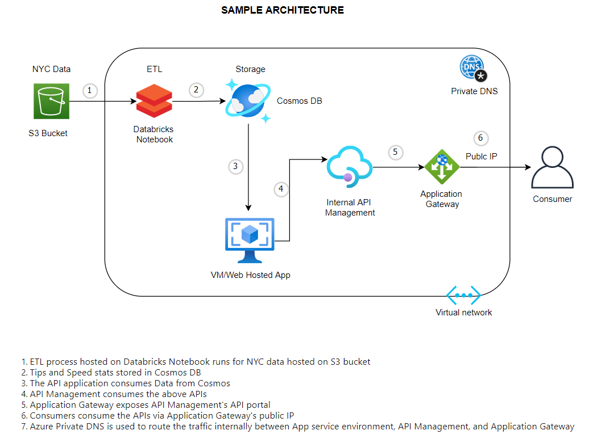

NYCTaxi
===============================

version: 0.0.1.  
author: Anmol Gupta <bits.akg@gmail.com>

Overview
--------

The goal of this exercise is to perform all the data transformation process (ETL) for yellow taxi data for 2020 and 
output insights via a REST endpoint.

Files:
* requirements.txt: Contains packages to run the project
* etl_runner.py: Runs the ETL process defined in class TaxiETL in TaxiETL.py
* TaxiETL.py: Contains all the extraction, load and transform code 
* app.py: Flask application for demonstrating API usage

Development
--------------------

Clone the GIT repository:

    $ git clone https://github.com/Anmol007/NYCTaxi.git

Recreate the environment with conda or venv and install requirements with:
    
    $ pip install -r requirements.txt
    

Usage
--------------------

The entry point for running ETL is defined at .\etl_runner.py

Example run:

    python .\etl_runner.py 

The entry point for serving the APIs is defined at .\app.py
Example run:

    python .\app.py 
    
  
REST endpoint Contracts

* GET `/api/tip/2020/01/max` – return max tip % for first quarter of 2020
    
      {
         "maxTipPercentage": 25,
        }
  

* GET `/api/tips/2020/max` – return max tip % for all quarters of 2020

      {
      "maxTipPercentages": [{
        "quarter": 1,
        "maxTipPercentage": 25
          },{
        "quarter": 2,
        "maxTipPercentage": 22
          }…],
          }
  
* GET `/api/speed/2020/01/01/max` – return max speed for the 1st January 2020

      {
        "tripSpeeds": [{
          "hour": 1
          "maxSpeed": “60mph”
          },{
          "hour": 2
          "maxSpeed": “50mph”
          }],
          }

  

Software dependencies
------------------------
* Python 3.6
* jdk1.8.0_291
* https://github.com/steveloughran/winutils

Sample Architecture
------------------------
